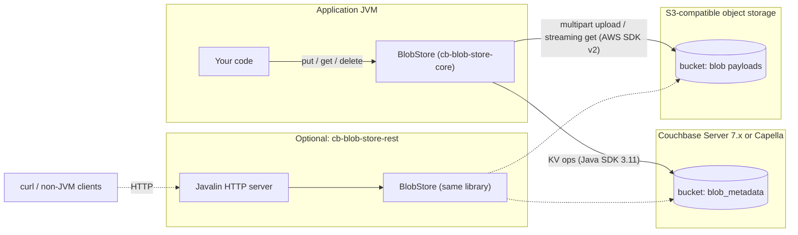
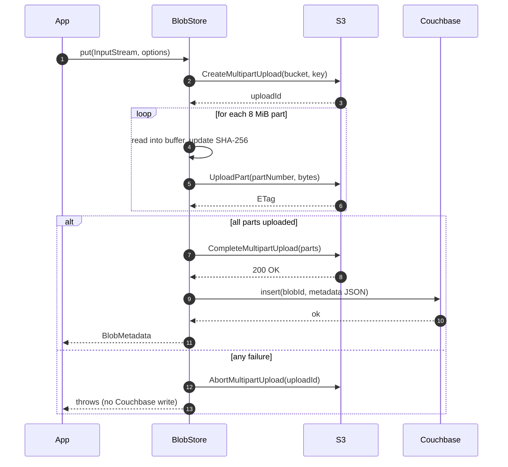
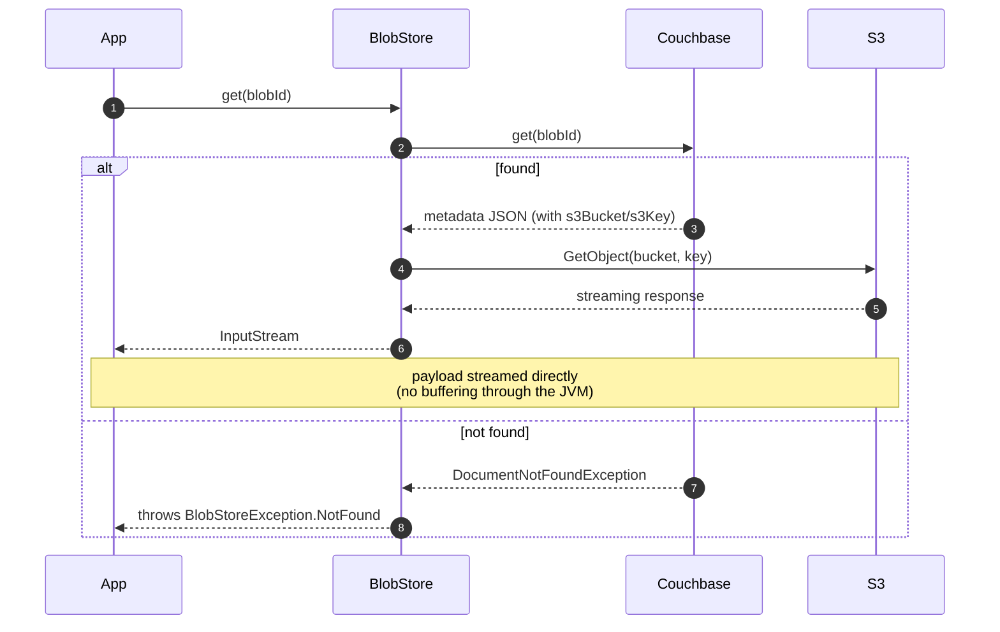
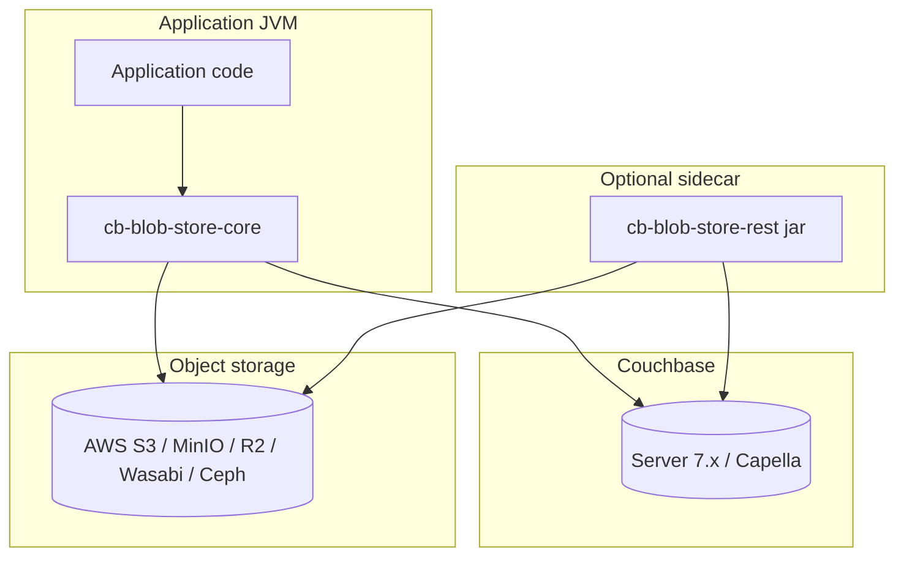
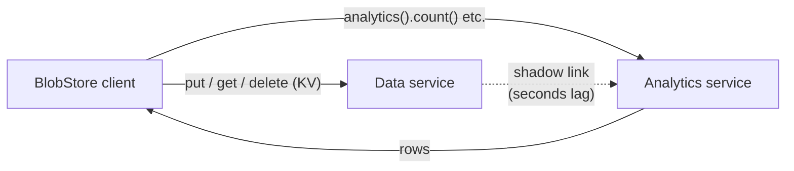
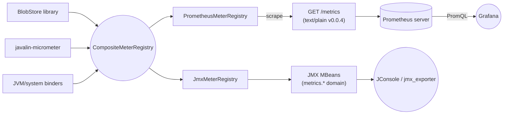
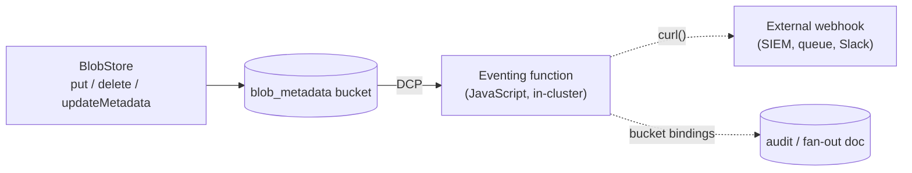
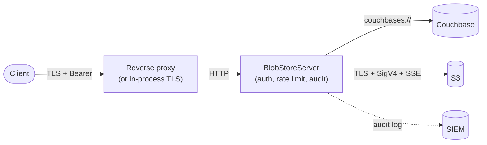
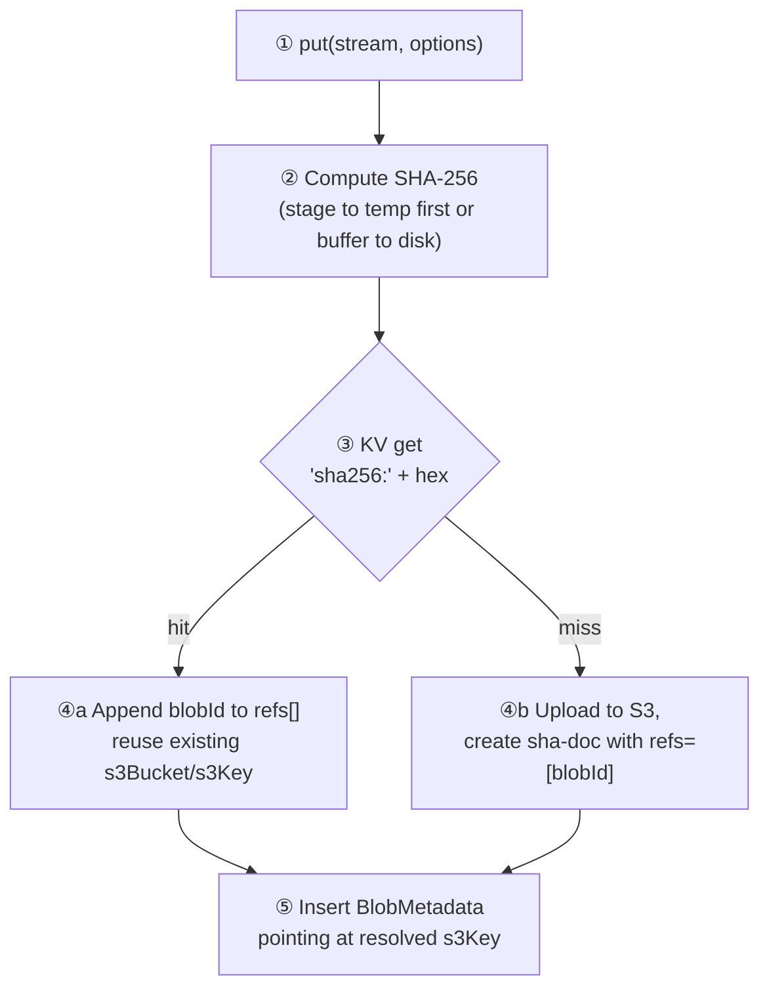

# Architecture — `cb-blob-store`

## 1. Context

`cb-blob-store` is a Java reimagining of the (now-archived) [`couchbaselabs/cbfs`](https://github.com/couchbaselabs/cbfs) project. The original was a Go-based distributed blob store that ran as a separate service alongside Couchbase: it kept file *metadata* in Couchbase and stored file *content* sharded across the local disks of cbfs nodes, exposed over HTTP.

This project keeps the same split (metadata in Couchbase, content elsewhere) but makes three deliberate changes:

| Concern | `cbfs` (original) | `cb-blob-store` |
|---|---|---|
| Language | Go | Java 17 |
| Payload storage | Local disks of cbfs nodes (custom chunking, replication, gc) | S3-compatible object storage (durability + scale delegated to the object store) |
| Shape | Standalone service only | Library (primary) + optional REST sidecar |
| Couchbase SDK | 1.x KV protocol | Java SDK 3.11.x — supports Capella, Server **7.6**, and Server **8.x** |

### Why "library + optional sidecar"

Couchbase Server does **not** expose an in-process Java extension SPI — you cannot load JARs into the server like an Elasticsearch plugin or a PostgreSQL extension. The two realistic ways to "extend" Couchbase from Java are:

1. **A client-side library** that wraps the official SDK and presents new high-level operations. This is what your application links against.
2. **A sidecar service** in front of Couchbase that presents an HTTP API (the cbfs pattern).

We ship both. The library is primary because it has no operational overhead and is the natural fit for "API extender." The sidecar is the same code packaged with a Javalin HTTP server, included for users who want a `curl`-able service or a polyglot blob store.

## 2. Component diagram



## 3. Data model

### 3.1 Couchbase metadata document

One document per blob, keyed by `blobId` (a UUIDv4 unless the caller pins it).

```json
{
  "type":           "blob",
  "id":             "8f1e2d4a-7c3b-4f0a-9e7d-1c2a3b4c5d6e",
  "name":           "Q3-financials.pdf",
  "contentType":    "application/pdf",
  "size":           184320192,
  "sha256":         "e3b0c44298fc1c149afbf4c8996fb924...",
  "s3Bucket":       "company-blobs",
  "s3Key":          "blobs/8f1e2d4a-7c3b-4f0a-9e7d-1c2a3b4c5d6e",
  "createdAt":      "2026-05-13T14:22:09Z",
  "updatedAt":      "2026-05-13T14:22:09Z",
  "owner":          "alice@example.com",
  "project":        "research-q2",
  "retentionUntil": "2027-05-13T14:22:09Z",
  "tags":           { "team": "finance", "env": "prod" },
  "attributes":     {
    "schemaVersion": 2,
    "source":        { "kind": "ingest", "node": "ingest-01" }
  }
}
```

Fields split into three groups:

- **System-set** — `id`, `size`, `sha256`, `s3Bucket`, `s3Key`, `createdAt`, `updatedAt`. The library writes and re-writes these; callers never set them directly.
- **Caller-set typed** — `name`, `contentType`, `owner`, `project`, `retentionUntil`. Typed top-level because they're the recurring needs for any blob system. One secondary index covers filter-by-owner, by-project, by-retention.
- **Caller-set freeform** — `tags` (`string → string`) for cheap labels; `attributes` (`string → arbitrary JSON`) for nested structures or non-string values. Null-valued attributes are allowed (Java `Map.copyOf` rejects them; the constructor uses `Collections.unmodifiableMap(new LinkedHashMap<>(...))` to preserve them).

All caller-set fields can be replaced in place by `BlobStore.updateMetadata(id, options)`, which leaves the S3 object untouched and bumps `updatedAt`.

The `type` field is constant (`"blob"`) so a single secondary index covers all queries:

```sql
CREATE INDEX idx_blob_type ON `blob_metadata` (type, name, createdAt)
  WHERE type = 'blob';
```

For owner/project/retention queries, add a second covering index:

```sql
CREATE INDEX idx_blob_custom ON `blob_metadata` (owner, project, retentionUntil)
  WHERE type = 'blob';
```

### 3.2 S3 object layout

One S3 object per blob:

```
s3://{s3Bucket}/{s3KeyPrefix}{blobId}
```

The S3 key carries no application meaning — all metadata lives in Couchbase. This deliberately avoids the cbfs-style content-addressed scheme; a content-addressed dedup approach is documented as a design option in §9c.

## 4. Upload sequence

The hot path. Bounded memory (one part at a time) regardless of payload size.



**Failure ordering matters.** We commit S3 before writing the metadata doc. A crash in the narrow window between `CompleteMultipartUpload` and `Collection.insert` leaves an orphan S3 object — never an orphan metadata doc pointing at non-existent content. Orphan objects are easy to garbage-collect (see §6); orphan metadata would be a poisoned read.

## 5. Download sequence



The returned `InputStream` is the S3 SDK's `ResponseInputStream`. Closing it closes the underlying HTTP connection.

## 6. Reconciliation (`fsck`-style)

Two failure modes leave inconsistent state:

| Scenario | State left behind | Sweep strategy |
|---|---|---|
| Crash between `CompleteMultipartUpload` and metadata `insert` | Orphan S3 object, no metadata | Periodic job: list S3 keys, look up matching id in Couchbase, delete S3 objects with no metadata older than N hours |
| `delete` aborts between S3 delete and Couchbase delete | Dangling metadata pointing at missing key | `get` already surfaces this as a clear error; sweep deletes metadata where S3 HEAD returns 404 |
| Aborted multipart upload | Partial upload state in S3, no metadata | S3 lifecycle rule: `AbortIncompleteMultipartUpload` after 1 day |

The third item is configured in S3, not in code, and is **required** to avoid paying for failed-upload bytes.

## 7. Deployment



Both deployment shapes share the same backing services. The library and sidecar can coexist against the same Couchbase bucket and the same S3 bucket — they read each other's data because the metadata document format is the contract.

## 8. Concurrency and consistency notes

- `BlobStore` implementations are thread-safe; the underlying `Cluster` and `S3Client` are designed for sharing.
- Two concurrent `put` calls for the same explicit id race on the Couchbase `insert` — the loser gets `DocumentExistsException` wrapped as `BlobStoreException`, but **both** will have uploaded to S3. Tradeoff is deliberate; if you need exclusivity, generate the id outside and use `getMetadata` to probe first, or accept the orphan S3 object (cleaned by §6).
- Concurrent reads are independent and safe.
- `delete` followed by `get` is read-your-own-write within a node (Couchbase KV is strongly consistent on the master).

## 8b. Analytics service integration

The Couchbase Analytics service (CBAS) sits next to the Data, Query, Index, and Search services and runs aggregate SQL++ on a separate column store. `cb-blob-store` reads from CBAS through `BlobAnalytics`, which proxies `Cluster.analyticsQuery(...)`. KV writes from `BlobStore.put()` reach Analytics via the Local link's shadow process — eventually consistent, typically within seconds.



Operational properties:

- **No competition with KV traffic.** Analytics queries hit Analytics nodes; `put`/`get` keep their KV latency profile.
- **Read-only for `BlobAnalytics`.** The helpers only emit `SELECT`. Even the `rawQuery` escape hatch is intended for read paths; mutating Analytics queries (`UPSERT INTO`) are technically supported by the SDK but out of scope for the library.
- **Dataset lifecycle is operator-owned.** The library does not create or connect the Local link, and refuses to fall back to N1QL on the Query service if the dataset is missing — that fallback would hide a misconfigured Analytics deployment.
- **Capella Columnar is an alternative.** Capella's Columnar service is a separately licensed, dedicated analytics tier with its own SDK. The library uses the in-cluster Analytics service that ships free with Couchbase Server Enterprise / Capella; migrating to Columnar later is a connection-string change, not a code change.

Query semantics map cleanly:

| BlobAnalytics method | SQL++ shape |
|---|---|
| `count()` | `SELECT count(*) FROM <ds> WHERE type = 'blob'` |
| `totalBytes()` | `SELECT sum(size) FROM <ds> WHERE type = 'blob'` |
| `summary()` | `SELECT count(*), sum(size), avg(size) FROM <ds>` |
| `countByContentType()` | `SELECT contentType, count(*) ... GROUP BY contentType` |
| `largestBlobs(n)` | `... ORDER BY size DESC LIMIT ?` |
| `byTag(k, v)` | `... WHERE tags.\`k\` = ?` (key allow-listed) |
| `largerThan(n)` | `... WHERE size > ?` |
| `createdBetween(a, b)` | `... WHERE createdAt >= ? AND createdAt < ?` |

## 8c. Monitoring topology

The REST sidecar wires a single Micrometer `CompositeMeterRegistry` that publishes to two registries at once: `PrometheusMeterRegistry` (scraped at `GET /metrics`) and `JmxMeterRegistry` (visible through any JMX-aware tool). The same registry is passed to `BlobStore.builder().meterRegistry(...)`, so library counters and timers land in the same place.



What gets published:

- **Library counters** — `cbbs.put.count`, `cbbs.get.count`, `cbbs.delete.count`, `cbbs.metadata.update.count`. Each is tagged `outcome={success, failure, not_found}` where applicable.
- **Library timers** — `cbbs.put.duration`, `cbbs.get.duration`. Outcomes split into success/failure/not_found buckets.
- **Library distribution summary** — `cbbs.put.bytes` (`baseUnit=bytes`), so you can see byte-volume percentiles independently of operation count.
- **Javalin route metrics** — `http.server.requests` (timer) per route + status, contributed by `javalin-micrometer`. Tagged by URI, method, exception name.
- **JVM/system metrics** — memory, GC, threads, classloader, processor, uptime, contributed by the standard Micrometer binders.

A common tag of `application=cb-blob-store` is set on the composite registry, so all metrics carry it.

Why both Prometheus and JMX? Prometheus is the dashboard story; JMX is the "ssh in and look at one node" story. Either one alone would be incomplete: Prometheus needs a server and dashboards; JMX needs no infrastructure but is a per-node view. Cost is one library instrumentation surface either way (the composite registry is transparent).

For a Grafana starter dashboard, the most useful PromQL queries are:

```promql
# request rate per endpoint, last 5 minutes
sum by (uri) (rate(http_server_requests_seconds_count[5m]))

# p99 upload latency
histogram_quantile(0.99, sum by (le) (rate(cbbs_put_duration_seconds_bucket{outcome="success"}[5m])))

# put outcomes
sum by (outcome) (rate(cbbs_put_count_total[5m]))

# bytes ingested per second
rate(cbbs_put_bytes_sum[5m])
```

## 8d. Couchbase Eventing integration

[Couchbase Eventing](https://docs.couchbase.com/server/current/eventing/eventing-overview.html) lets you attach JavaScript functions to bucket mutations. Because the metadata document is the contract between this library and the cluster, a function attached to the `blob_metadata` bucket sees every insert/replace/delete that goes through `BlobStore`. The library can't *host* JavaScript directly, but the library's writes are designed to be Eventing-triggerable.



Useful recipes:

**Auto-tag on PUT** — stamp a server-side tag (region, ingestion timestamp, vBucket) onto every new blob without round-tripping the application:

```javascript
function OnUpdate(doc, meta) {
  if (doc.type !== "blob") return;
  if (doc.tags && doc.tags["_region"]) return;     // idempotent
  doc.tags = doc.tags || {};
  doc.tags["_region"] = "us-east-1";
  doc.tags["_indexedAt"] = (new Date()).toISOString();
  blobBucket[meta.id] = doc;                       // bucket binding
}
```

**Retention enforcement** — sweep blobs whose `retentionUntil` has passed:

```javascript
function OnUpdate(doc, meta) {
  if (doc.type !== "blob" || !doc.retentionUntil) return;
  var due = Date.parse(doc.retentionUntil);
  if (isNaN(due) || due > Date.now()) return;
  // Mark for sweep. A separate scheduled job (or this same function on
  // a timer) reads the marker and calls DELETE /blobs/{id} on the sidecar.
  doc.tags = doc.tags || {};
  doc.tags["_expired"] = "true";
  blobBucket[meta.id] = doc;
}
```

**Dead-letter on missing S3 object** — the library throws when the S3 object referenced by a metadata doc has vanished. An Eventing function can react to that signal by writing a marker into a separate bucket for an out-of-band sweeper to investigate.

**Fan-out on delete** — emit a webhook (or another bucket write) every time a blob is deleted:

```javascript
function OnDelete(meta, options) {
  // `meta.id` is the deleted document's id; this function fires AFTER
  // the delete is durable. options.expired distinguishes TTL from explicit.
  var res = curl("POST", "https://siem.example.com/blob-deleted", {
    headers: { "Content-Type": "application/json" },
    body: { id: meta.id, at: new Date().toISOString(), expired: !!options.expired }
  });
  if (res.status >= 400) {
    log("dead-letter", meta.id, res.status);
  }
}
```

Operational notes:

- Eventing functions run **in the cluster**, not in the application. They need to be deployed via the Couchbase UI or `couchbase-cli eventing-function-setup`.
- Each function needs a separate metadata bucket (Eventing's own checkpointing) and bucket bindings declared up front — see RUNBOOK §10 for the deployment recipe.
- Eventing has at-least-once semantics. Make functions idempotent (the auto-tag example shows the pattern: check before write).
- `curl()` in an Eventing function is a real network call from the cluster. If your Eventing nodes can't reach the webhook host, the function will retry-and-block; budget for it.

## 9. What is intentionally *not* in scope

These existed in the original cbfs but are out of scope for this v1, and would be cleaner if added at the object-store layer than reinvented:

- **Replication and rebalancing of payload data** — delegated to S3.
- **View-server proxy / monitor UI** — original cbfs shipped a JavaScript monitor; not reproduced. Use Grafana over the `/metrics` endpoint (§8c) instead.
- **TAR / ZIP bulk endpoints** — original cbfs had these; can be layered on as a separate utility.

## 9b. Security boundaries



| Layer | Threat | Control |
|---|---|---|
| Network ingress | unauthenticated callers | `TokenAuthFilter` — constant-time bearer compare; `/healthz` only is allow-listed; fail-closed at startup |
| Network ingress | sniffing / MITM | TLS at reverse proxy or in-process via `CBBS_TLS_KEYSTORE_PATH`; HSTS header when TLS on |
| Network ingress | volumetric DoS | per-IP sliding-window rate limit; `CBBS_MAX_UPLOAD_BYTES` cap |
| Network ingress | CSRF / cross-origin abuse | CORS off by default; explicit origin allow-list only |
| Network ingress | content sniffing, framing, leakage | `X-Content-Type-Options`, `X-Frame-Options`, `Referrer-Policy`, `Cache-Control: no-store` |
| Caller-supplied data | path traversal, control chars in S3 keys | `IdValidator` regex + `..` and dot-boundary checks |
| Couchbase ↔ sidecar | credential theft | scoped RBAC user (§2.3 of RUNBOOK); never logged |
| S3 ↔ sidecar | unauthorized object access | scoped IAM policy on `blobs/` prefix; never logged |
| S3 at-rest | object inspection by storage operator | SSE-S3 (AES-256) by default; SSE-KMS supported with customer key |
| Couchbase at-rest | metadata inspection | Capella encryption-at-rest (always on) or self-managed disk encryption |
| Storage ↔ sidecar | namespace collision with other documents | `MetadataRepository` rejects documents whose `type != "blob"` |
| Audit trail | post-incident attribution | `io.cbblobstore.audit` logger with hashed principal, ip, blob id |

### Trust model and known gaps

- **Multi-instance rate limiting** is not coordinated. The in-process limiter is a per-instance backstop; primary protection belongs at the load balancer.
- **Token revocation** is restart-only — there is no live token store. For frequent rotation, front the sidecar with a gateway that does its own auth.
- **Confused-deputy on `PUT /blobs/{id}`** — the caller picks the id. Multiple tokens can read each other's blobs if they know the id. If you need per-token isolation, layer an external authorization service that maps tokens to allowed id prefixes, or build that on top of the library directly.
- **DoS via fast small uploads** is bounded by the per-minute rate limit, not by total bytes/sec. Add bandwidth limits at the proxy if needed.

## 9c. Content-addressed dedup (design only — not implemented in v1)

The library deliberately stores every blob as its own S3 object even when payloads are bit-identical. This keeps `put` predictable and the metadata document a single source of truth. If your workload has measurable duplication (CI artifacts, customer-uploaded files, ML training sets), the path forward is a content-addressed *lookup* document — never a content-addressed *S3 key* — so the metadata document layer keeps its current shape.



The sha-lookup document type:

```json
{
  "type":     "sha-lookup",
  "id":       "sha256:e3b0c44298fc1c149afbf4c8996fb924...",
  "s3Bucket": "company-blobs",
  "s3Key":    "blobs-by-hash/e3b0c44298fc1c149afbf4c8996fb924...",
  "size":     184320192,
  "refs":     ["blobId-1", "blobId-2", "blobId-3"]
}
```

What's required to implement this safely:

- **Two-phase put.** The library currently streams to S3 while computing the SHA in flight. Dedup needs the SHA *before* the S3 commit so the lookup can run first. Three concrete options: (a) buffer to a local temp file, (b) stage to a temporary S3 key (`blobs-tmp/{uuid}`) and `CopyObject` to the final key after the lookup miss, (c) require the caller to pre-compute the SHA (pushes the cost up the stack). Each has different tradeoffs against the cost of the duplicate S3 PUT in the miss case.
- **Refcount integrity.** `delete(blobId)` must remove the blobId from `refs[]` and only delete the S3 object when `refs[]` becomes empty. The KV mutation must be atomic — `Collection.mutateIn(...)` with a `arrayRemove` operation under CAS, retrying on conflict.
- **GC for orphaned lookup docs.** If a process dies between "uploaded to S3" and "inserted sha-lookup," you get an orphan in S3. The `fsck` job (§6) already cleans these by reverse-scanning S3 against Couchbase; the same job needs to learn about sha-lookup docs.
- **Hot-key contention.** Popular hashes (e.g. a 0-byte file) would funnel every concurrent put through the same KV document. A two-tier scheme — first stage `sha256:<hex>:<shard>` then merge — helps, at the cost of complexity. Cheaper option: special-case the empty hash.
- **Privacy.** Dedup leaks one bit per call ("does this content already exist?"). Out-of-scope here, but worth a privacy review before shipping for multi-tenant data.

The decision to ship v1 without dedup is deliberate: dedup changes the put hot path significantly, and the operational complexity (two-phase put, GC story, refcount races) is best taken on once there's measured duplication to justify it.

## 10. Module map

```
cb-blob-store/
├── pom.xml                            parent, version pins
├── cb-blob-store-core/                the library (depend on this)
│   └── io.cbblobstore.core
│       ├── BlobStore                  public interface
│       ├── BlobStoreBuilder           fluent builder
│       ├── BlobMetadata               JSON-serialised metadata
│       ├── BlobOptions                per-call options
│       ├── BlobAnalytics              SQL++ helpers over the Analytics service
│       ├── BlobStoreException         + .NotFound
│       ├── BlobStoreMetrics           Micrometer instrumentation surface
│       ├── CouchbaseS3BlobStore       the implementation
│       ├── IdValidator                input validation for blob ids
│       ├── SseMode                    NONE / AES256 / KMS
│       └── internal.MetadataRepository
├── cb-blob-store-rest/                optional sidecar (shaded jar)
│   └── io.cbblobstore.rest
│       ├── BlobStoreServer            main() + MetadataPatch DTO
│       ├── ServerConfig               env-var config
│       ├── TokenAuthFilter            bearer auth
│       ├── SlidingWindowRateLimiter   per-IP rate limit
│       └── AuditLog                   structured audit events
├── cb-blob-store-examples/
│   └── io.cbblobstore.examples.QuickStart
└── docs/
    ├── ARCHITECTURE.md                (this file)
    └── RUNBOOK.md
```

